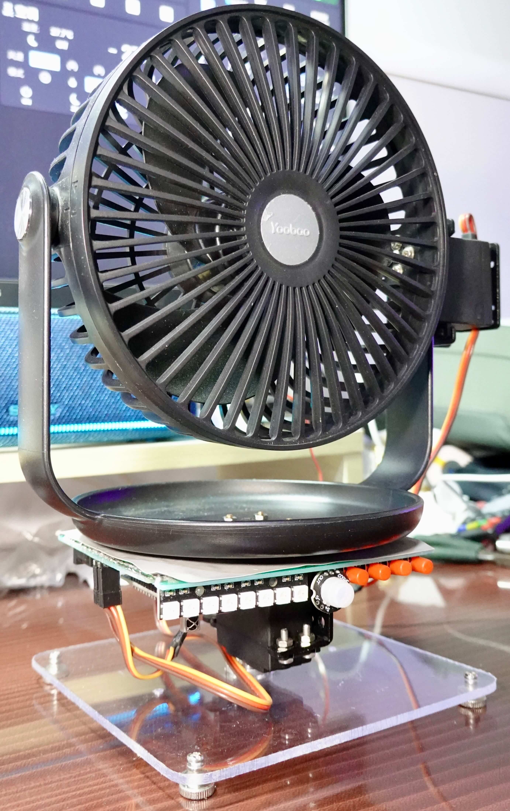
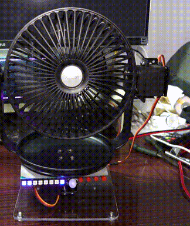
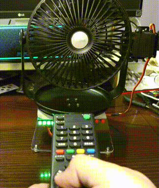
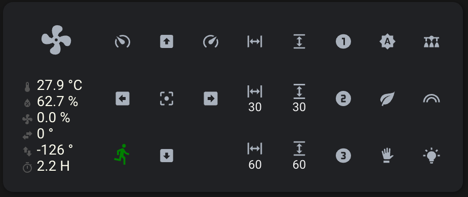

# ESPHome: Servo Fan

A fan controlled by ESP8266 with esphome. Support the following features:

* Horizontal and vertical servo, support set horizontal and vertical directions
  and oscillation in horizontal and vertical.
* PIR sensor to automatically turn on/off the fan.
* Remote controlled by the infrared controller.
* PWM controlled fan with natural mode support.

**Home Assistant UI Lovelace card**
